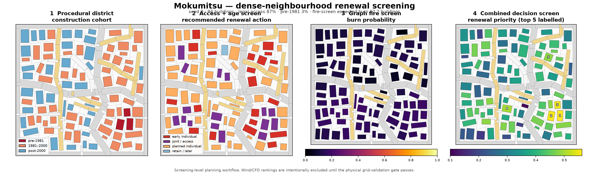

# Mokumitsu Urban Renewal

[日本語](README.ja.md)

Mokumitsu is a research prototype for staged renewal of dense Japanese
wooden-residential neighbourhoods. It combines organic district generation,
road-access proxies, stochastic fire-spread screening, summer pedestrian-wind
screening, joint redevelopment, phased feasibility, and Pareto comparison.

The project is deliberately narrower than a generic urban optimizer. Its current
question is:

> How can access-poor, fire-vulnerable parcels be renewed in an implementable
> sequence while preserving dwelling capacity and improving connected open space
> and local wind conditions?

Houdini is an optional geometry and visualization adapter. The Python research
core does not import hou. Realistic CFD verification is delegated to the separate
[houdini-xlb](https://github.com/otanl/houdini-xlb) project.

*A reproducible seed-0 overview generated by
`scripts/render_readme_overview.py`: organic district generation, access/age
renewal actions, graph-based fire screening and the combined renewal priority.
Wind/CFD ranking is deliberately omitted until the physical grid-validation
gate passes.*

## Status

Version 0.1 is complete as a reproducible **synthetic research prototype and
Houdini sample**, not as a validated planning or regulatory tool. The first v0.2
slice adds live, editable joint-redevelopment screening inside Houdini.

**Wind-model audit (2026-07-19):** the residential-v1 dataset and both derived
FNO checkpoints are quarantined. One XLB sample is numerically catastrophic, the
old vertical-coordinate contract is invalid, and the corrected KBC setup fails
the current grid-independence gate. Wind-dependent rankings and cached heatmaps
are historical demonstrations only; dataset-v2 generation is deliberately blocked.
See [Wind validation status](docs/WIND_VALIDATION_STATUS.md).

| Capability | Status |
|---|---|
| Organic dense-neighbourhood generation | Implemented and deterministic |
| Building age and road-access renewal priority | Implemented as explicit proxies |
| Stochastic fire-spread screening | Implemented; not a certified fire model |
| Cardinal summer wind-rose screening | Code implemented; no scientifically valid public checkpoint |
| Two-to-four-parcel joint renewal and Pareto screening | Implemented |
| Phased rights, relocation, dwellings, open space and scenario cost | Implemented |
| Cached Houdini delivery and wind-field timelines | Included as quarantined historical visualization |
| Live joint massing edits with automatic FNO/fire re-evaluation | Geometry/fire path implemented; wind awaits v2 model |
| Public residential FNO weights, metadata and XLB training dataset | v1 release quarantined; audit-only override |
| XLB verification of shortlisted designs | Physical contract corrected; grid gate currently fails |
| Real cadastral ingestion and empirical calibration | Not yet implemented |

The immediate scientific blocker is a stable, grid-independent external-wind
protocol. Real-district calibration, uncertainty analysis, and validation of
fire, cost and legal assumptions follow after that. See
[Project status and roadmap](docs/ROADMAP.md).

## Repository layout

    src/mokumitsu/   Houdini-independent district, fire, wind and renewal code
    scripts/         Reproducible experiments and XLB verification entry points
    houdini/         Optional HIP builders; importing the package never needs hou
    examples/        Three HIP scenes and two small precomputed playback caches
    models/          Release manifest, checksums, license and model release notes
    tests/           CPU-runnable unit and integration tests
    docs/            Research method, related work, architecture and roadmap

Repository boundaries and dependency direction are documented in
[Architecture](docs/ARCHITECTURE.md).

## Installation

Python 3.10–3.12 is supported. Python 3.12 is the tested development version.

    uv venv --python 3.12
    uv pip install -e ".[dev,viz]"

Run the standalone test suite:

    .venv\Scripts\python.exe -m pytest -q
    .venv\Scripts\python.exe -m ruff check .

On macOS or Linux, use .venv/bin/python instead.

## Core workflow without a wind checkpoint

District generation, access assessment, renewal priority and fire screening do
not need Houdini, XLB or a trained wind model.

    .venv\Scripts\mokumitsu.exe generate --seed 0 --out outputs\mokumitsu.json
    .venv\Scripts\mokumitsu.exe prioritize --district outputs\mokumitsu.json --limit 20 --out outputs\priorities.json
    .venv\Scripts\python.exe scripts\simulate_mokumitsu_fire.py --wind-dir 0 --wind-speed 5

The generator intentionally produces irregular roads, cul-de-sacs, rear lots and
flag-shaped access conditions. The optional grid mode exists only as a control.

## Wind-aware and joint-renewal workflow

There is currently no supported public residential wind checkpoint. The normal
downloader refuses the quarantined v1 release. Historical reproduction is
possible only with an explicit audit override:

    .venv\Scripts\python.exe scripts\download_models.py --allow-quarantined --profile all --include-dataset

Do not use those assets for design evaluation, retraining, or quoted results.
District generation, access, fire, renewal, rights, dwellings, cost and
open-space evaluation remain usable without a wind model.

The replacement pipeline has a hard scientific gate:

    .venv\Scripts\python.exe scripts\verify_residential_grid.py
    .venv\Scripts\python.exe scripts\gen_residential_dataset.py
    .venv\Scripts\python.exe scripts\validate_residential_dataset.py data\residential_xlb_v2.npz
    .venv\Scripts\python.exe scripts\train_residential_fno.py --data data\residential_xlb_v2.npz

Dataset generation stops unless the grid report passes and exactly matches the
requested XLB configuration and backend signature. The allow-unconverged option
exists only for small implementation smoke tests.

## Houdini samples

The repository includes scenes generated with Houdini Indie 20.5.684. Their
geometry, renewal, fire, rights and cost content remains inspectable, but bundled
v1 FNO wind values are quarantined historical visualization:

- [Live joint-design study](examples/houdini_joint_design.hip): edit the selected
  two-to-four-parcel project, building position, coverage, aspect, rotation,
  floors, road dedication, ventilation corridor and shared-open-space policy.
  With a compatible v2 checkpoint, FNO wind updates with the stochastic fire,
  floor-area retention and open-space metrics; without one, the non-wind study
  remains usable. There is no analysis Run button.
- [Joint feasibility timeline](examples/houdini_joint_feasibility.hip): baseline
  plus three joint-renewal projects, rights/cost/dwelling HUD, delivered open
  space, and a cached FNO U/U0 heatmap controlled by WIND_DISPLAY_TOGGLE.
- [District renewal timeline](examples/houdini_mokumitsu.hip): building age,
  access, fire and wind screening across staged individual renewal.

The two timeline scenes use small bgeo.sc sequences in examples/cache, so they
can be inspected without rerunning FNO, fire simulation or optimization. The
live scene instead writes content-addressed bgeo.sc files for edited designs to
`$HIP/cache/joint_design`; those generated files remain outside Git. In every
scene the wind field is a scalar FNO screening result, not an XLB vector field.

For the live scene, install the optional NeuralOperator runtime in the project
environment and point Houdini to that Python:

    uv pip install -e ".[dev,viz,interactive]"
    $env:MOKUMITSU_CHECKPOINT_DIR = "D:\models\mokumitsu"
    $env:MOKUMITSU_PYTHON = "$PWD\.venv\Scripts\python.exe"

The persistent worker and portable TorchScript paths remain implemented, but
current wind evaluation rejects checkpoints without the v2 physical metadata.
The residential-v1 Release is retained only for audit and is marked quarantined
in [models/manifest.json](models/manifest.json). Geometry remains editable when
a compatible model is unavailable.

To rebuild locally:

    $HYTHON = "C:\Program Files\Side Effects Software\Houdini 20.5.xxx\bin\hython.exe"
    .venv\Scripts\python.exe scripts\evaluate_joint_feasibility.py --include-districts
    & $HYTHON houdini\build_joint_design_hip.py
    & $HYTHON houdini\build_joint_feasibility_hip.py
    & $HYTHON houdini\build_mokumitsu_hip.py

The current clone can rebuild geometry, fire and feasibility content, but it
cannot produce a supported wind field until a v2 checkpoint passes the stated
gates. The live adapter itself can be checked headlessly and benchmarked with:

    & $HYTHON houdini\verify_joint_design_hip.py
    .venv\Scripts\python.exe scripts\bench_joint_design_worker.py

The v1 XLB dataset must not be retrained into a replacement model. A v2 dataset
will be generated and exported only after the physical grid gate passes; the
commands and contract are documented in
[Wind validation status](docs/WIND_VALIDATION_STATUS.md).

## Optional XLB verification

Shortlisted layouts can be checked with the Apache-2.0 XLB backend exposed by
houdini-xlb:

    uv pip install -e ".[verify]"
    .venv\Scripts\python.exe scripts\verify_joint_renewal_xlb.py
    .venv\Scripts\python.exe scripts\verify_cluster_renewal_xlb.py

This path requires a supported NVIDIA GPU, Warp 1.10.0, and the platform setup
documented by houdini-xlb. XLB verification is intentionally outside the
Mokumitsu core package.

## Documentation

- [日本語README](README.ja.md)
- [Research method / 研究ノート](docs/RESEARCH.md)
- [Related work / 先行研究](docs/MOKUMITSU_RELATED_WORK.md)
- [Architecture and repository boundaries](docs/ARCHITECTURE.md)
- [Wind validation status / 風解析監査](docs/WIND_VALIDATION_STATUS.md)
- [Project status and roadmap / 現状とロードマップ](docs/ROADMAP.md)
- [Contributing](CONTRIBUTING.md)
- [Changelog](CHANGELOG.md)
- [Citation metadata](CITATION.cff)

The top-level README and code-facing documentation are English for OSS
discoverability. The detailed research and Japanese planning/regulatory context
remain in Japanese to avoid flattening domain-specific terminology.

## Scope decision

The first **interactive parametric design inside Houdini** slice is now in place:
the same core evaluator serves Python and Houdini, preview cache keys include
geometry, scenario, policy and model identity, and a persistent worker avoids
per-edit model startup. The next priority is to pass the external-wind physics
gate. Pareto browsing, preview/verification provenance and heavier asynchronous
evaluation resume only after a valid v2 checkpoint exists.

A third, generic environmental multi-objective optimization repository will not
be created yet. It should be extracted only after at least two independent design
domains demonstrate the same evaluator and optimizer interfaces. This avoids
premature abstraction and keeps the research claim auditable.

## License

MIT. See [LICENSE](LICENSE).
